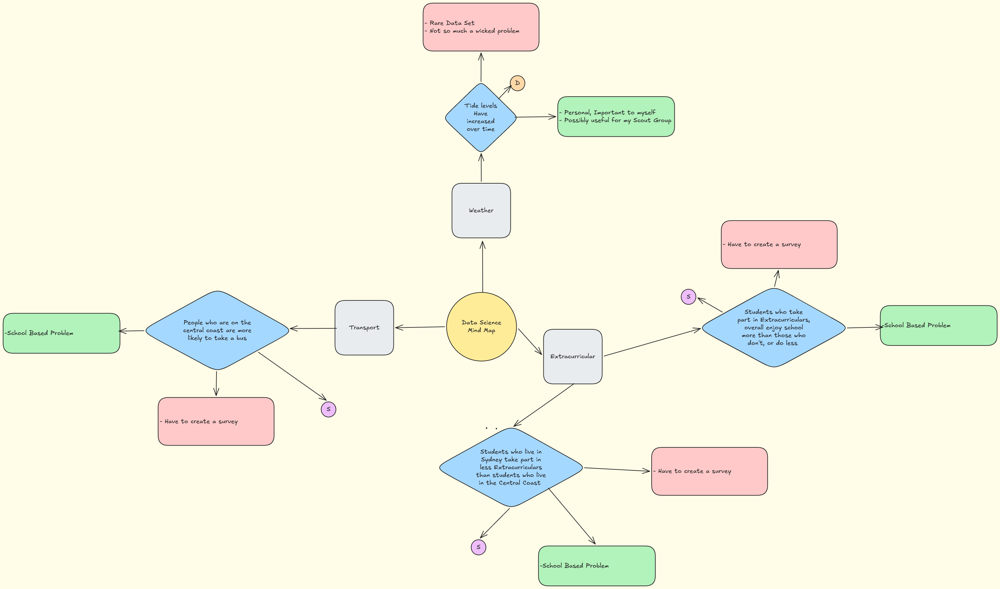

# Data Science Project
## Phase 1 - Identifying & Defining
### Mindmap:

### Hypothesis
Students who take part in extracurricular activities overall enjoy school more than those who don’t, or do less.
### Requirements Outline
#### Functional
In order for my program to meet its functional goal it must adhere to a set of requirements. My program should be able to load in data in a format such as .csv, my program will not be required to handle errors in loading as my data will have already been corrected. For the same reason that my program will not have to handle file errors, my program won’t be required to handle missing or error values. My program will be required to find the mean of some aspects of the data to allow for data visualization. My program is required to use both PANDAS and MATPLOTLIB for easy visualization through data frames and graphs/charts, utilising dataframes, bar charts, and line graphs. My data will be stored as a .csv file which will allow me to easily access the data in my program.
#### Non-Functional
In order for my program to adhere to its non-functional requirements it must meet 2 main goals, usability and reliability. For usability my program will need a helpful and informative README, which outlines; installation instructions, required Libraries, how to run the program, example usage, and a troubleshooting section. The program itself must also have an intuitive menu, it isn’t required to have a graphical user interface, but an easy to use text based interface. For reliability, the program must be able to validate all user interfaces, prevent data corruption, provide clear error messages when any process or input fails, and make sure no change to the data occurs without user confirmation.

#### Use Case
Actor: User

Goal: To access and interact with existing data through the program’s user interface.

Preconditions:

The dataset has already been preloaded into the system by an myself.

The user has access to the system.

Main Flow:

After launching the program, a text menu appears for the user to choose from

Using the text menu User selects one of the following options: 
a. View visualisation (e.g., chart or graph of selected data) 
b. Search or filter data based on specific criteria 
c. Veiw data Statistics
d. Compare Fields
e. Quit

The system carries out the selected action and displays the result to the user.

Postconditions:

The system saves all valid updates

Information remains available for additional searching or review
## Phase 2 - Researching & Planning
### Research
Data or information available on my topic is very limited, and if their is any of it it's not easy processed down into usable data. This made it so I was required to make a survey, which although more work allowed me to pinpoint the specific information I need. 

*Talk about survey*
### Findings
*Discuss the above information in at least one SEEL / SEEC Paragraph.*
### Data
### Planning
#### Survey: https://forms.gle/78fqpbPkFroJuN8u7
#### Data Dictionary
| Field | Data Type | Format | Description | Example | Validtion |
| - | - | - | - | - | - |
| Extra Curriculars | str (categorical) | XX...XX | Voluntary, non-academic pursuits undertaken by students outside of regular school curriculum | Scouts;Swimming;Other | Any string, excluding numbers, each string seperated by semicolons (;) |
| Extra Curricular Hours / Week | int64 (hours per week) | N | Number of hours taking part in Extracurricular Activities | 0 | Single digit (0-9)
| School Opinion | int64 (1-10 rating) | N | Opinion on school overall, excluding breaktime | 6 | Single digit (0-9)
| Breaktime Opinion | int64 (1-10 rating) | N | Opinion on breaktime overall, including recess, lunch, before and after school, and free periods.  | 7 | Single digit (0-9)
## Phase 3 - Producing & Implementing
### Missed Commitments:
## Phase 4 - Testing & Evaluating
### Test
### Analysis
### Peer Verification
### Evaluation

# To Do
- Annotate Code
- Read Me
- All of Testing and Evaluating